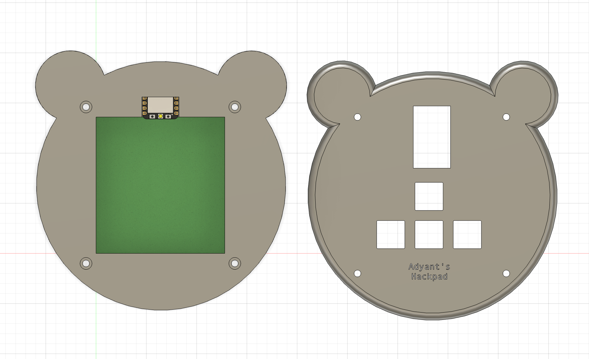
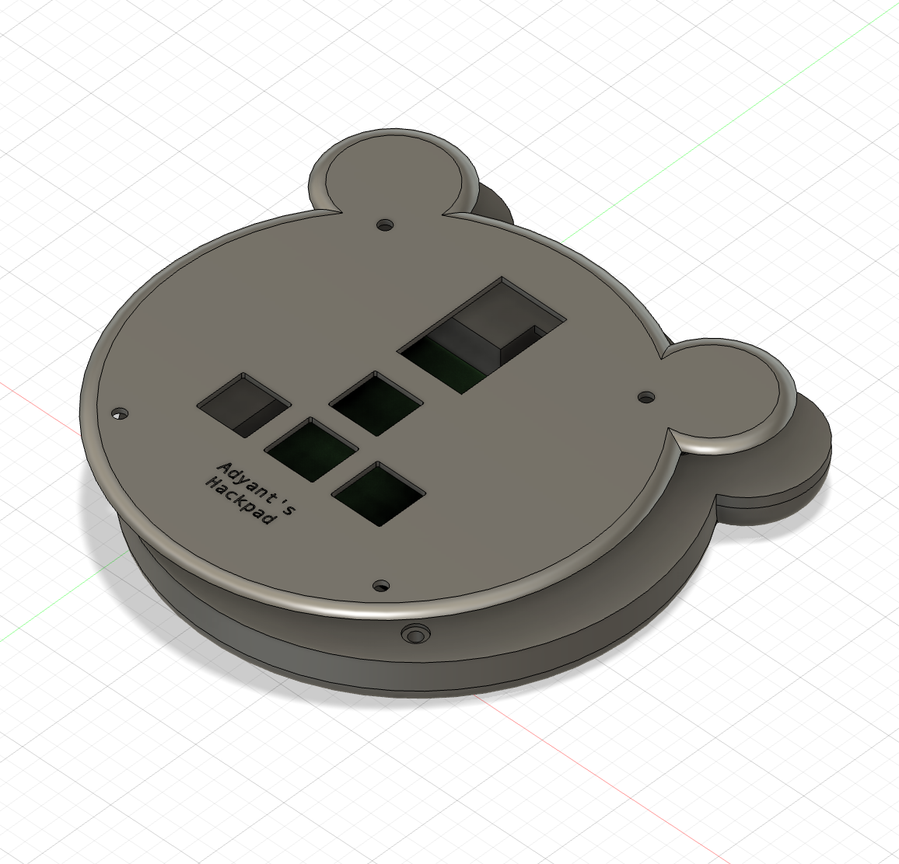
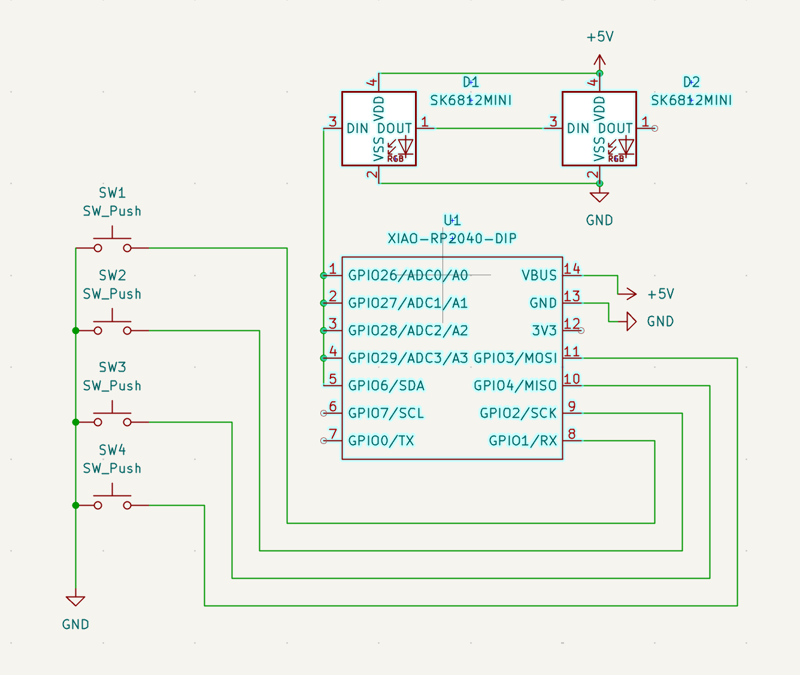
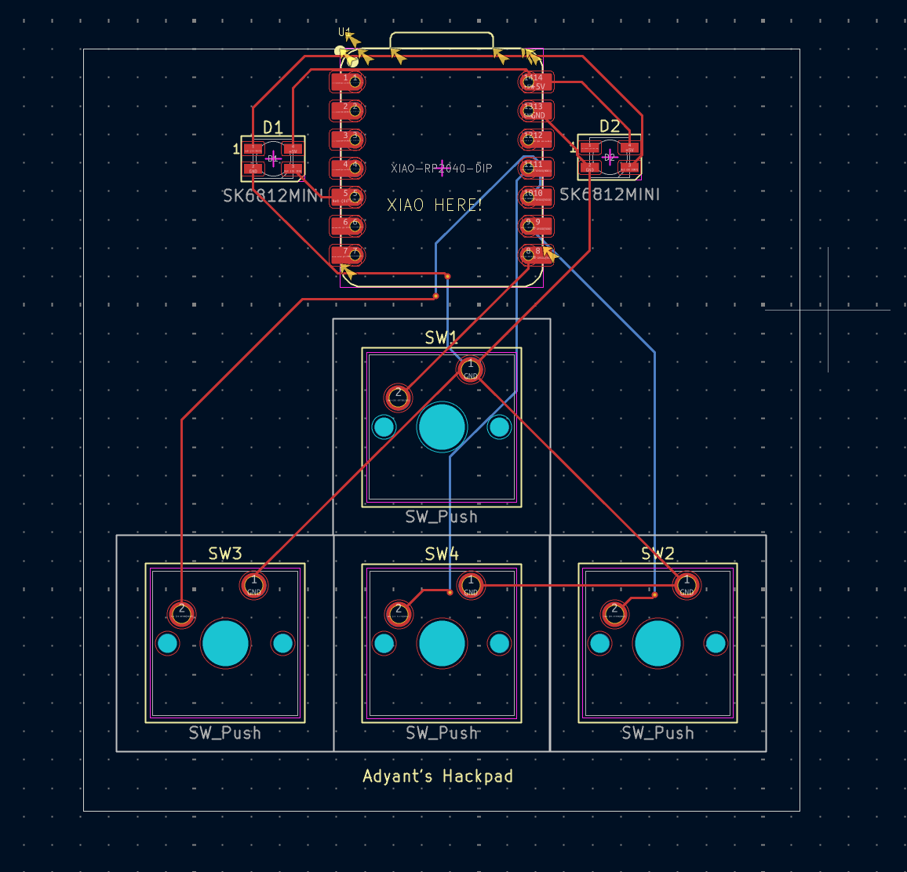

# Adyant's Bearpad 🐻
Hi! My hackpad is a 4 key macropad designed to help my productivity in fusion 360 and my day-to-day life. It's designed in the shape of my favorite animals - the bear! 

## Features:
- 4 switches
- 1 RP2040
- 2 leds
- 1 * 3 layout
- Key's designed to help me make the most out of fusion 360 like the extrude key (e)
- Other key's designed for mac-OS optimized shortcuts
- Uses KMK firmware and can be easily remapped
- Cute bear case! 

## Inspiration: 
While working between Fusion 360, coding environments, and general macOS tasks, I noticed that a certain actions were repeated constantly. That's why I built this Hackpad to speed up common actions I use constantly across macOS and Fusion 360, such as undo, extrude, and app switching.

## Challenges: 
One of the biggest challenges I faced in this project was learning PCB design in KiCad for the first time. I had to learn how to create the schematic and then map all the wires. I had to learn new strange tools like running DRC but the tutorial made it much more simpler. Building the case in Fusion was also difficult and I had to perservere when it came to making my own custom bear case.

## CAD Model:
Complete Model:

Case:

## PCB: 
Schematic:

PCB:

## Firmware:
I wrote the firmware using kmk firmware and you can see it in the repo.

## BOM:
- 4x Cherry MX Switches - $0.38/per ($1.52)
- 2x SK6812 MINI Leds - $2.80
- 1x XIAO RP2040 - $4.99
- 4x Blank DSA Keycaps - $0.69/per ($2.76)
- 4x M3x16 Bolt - $1.00
- 4x M3 Heatset - $0.15/per ($0.6)
